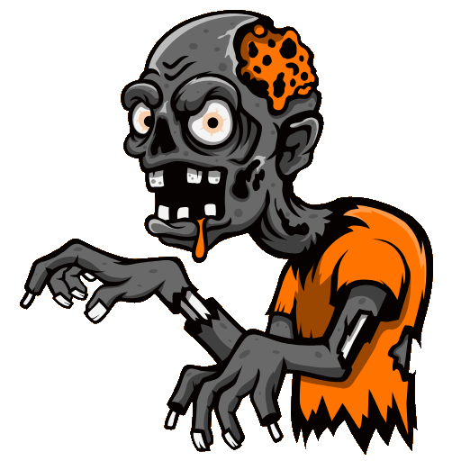

# Zombees Guides — Public README & Issue Tracker

This repository tracks issues, bug reports and improvement requests for the mobile app **Zombees Guides**.

---

## App links

	
	&nbsp;
	

---

## What is this app?
Zombees Guides is a small companion app for Call of Duty Zombies. Think of it as a quick-reference companion while you're solving an Easter Egg (EE) — step-by-step instructions, helpful images, and small hints so you and your team can focus on the run.

The app is designed to be lightweight and fast: use it mid-game, glance at the next step, mark progress, and get back to playing.

---

## Community & Issues
I want this project to be shaped by the people who use it. Please file issues for bugs, missing steps, or feature ideas. When creating an issue, include:

- A short, descriptive title
- Steps to reproduce or the exact step that is unclear
- Device + OS version (if the bug is device-specific)
- Screenshots or short screen recordings when helpful
- Suggest the label you think fits: `bug`, `enhancement`, `docs`, `question`

I'll triage issues regularly and prioritize fixes and improvements.

---

## Why I built this
I grew up playing Black Ops 3 and loved the creativity of the Easter Eggs. Years later, remembering every step became harder and runs became more chaotic without a single shared reference.

I wanted a simple companion that could live in my pocket during a run — something my friends and I could rely on to coordinate and remember the steps. I started this project to capture those steps, and to build a small community around preserving and improving guides together.

---

## How you can help
- Report issues and unclear steps
- Suggest improvements or additional images
- Contribute to guides

Contributions are welcome — open a PR or start a discussion via GitHub Issues.

---

## Contact
For quick questions or to share guide assets, open an issue. You can also find me on GitHub via my profile.

---

Thanks for checking out Zombees Guides — let's build a helpful companion and a friendly community around it!
